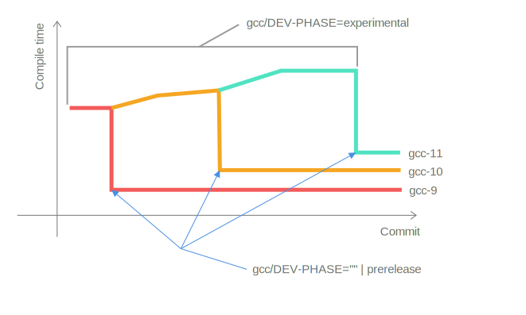

# RTB: Race To Binary

This static site presents interactive charts on C/C++ compiler (i.e GCC, Clang) compile times for
different source files across a large time window.
Additional information such as the packaged (compressed) compiler size is also available.

The idea is to track compiler *build time* regressions or improvements over different versions,
this is interesting due to how complex C/C++ has become over the years.

**Select a dataset on the top left ↖ to get started!**

### Note on GCC performance/size

GCC's compiler time performance will be low (slower) unless the content of `gcc/DEV-PHASE` in the
repository is set to either `prerelease` or the empty string.
This is usually done when a release is branched off with a proper version tag.
For a concrete example,
see [GCC-12's DEV-PHASE history](https://github.com/gcc-mirror/gcc/commits/releases/gcc-12/gcc/DEV-PHASE).
GCC's compiler size is also affected by this as experimental builds will contain extra debug
symbols.



### What is this written in?

This website is implemented in Scala 3 for both the static site generation and the *reactor*.

A standalone Scala program ingests a simple job script, for example:

```shell
#!/bin/bash
# RTB gcc llvm dpcpp
_fixture() { :; } # executed once per job
_setup() { :; }   # executed once for each compiler 
_test() {         # executed multiple times for each compiler
  set -o xtrace
  "$RTB_CXX" $RTB_EXTRA_FLAGS -std=c++17 -O3 -march=native -xc++ - <<EOF
#include <iostream>
int main(int argc, char *argv[]) {
   std::cout << "Hello, World!" << std::endl;
   return EXIT_SUCCESS;
}
EOF
}
_check() { ldd a.out; } # executed once after _test 
```

The script is sourced for each compiler snapshot, and the `_test` function is timed and executed
multiple times.

For the frontend, we use [Laminar](https://github.com/raquo/Laminar) together
with [Bulma](https://bulma.io/) for UI.
Most of the chart is implemented from scratch directly in SVG.

### Source & Contact

This repo is available at <https://github.com/UoB-HPC/rtb>.
If you think something isn't right, please file an issue in the repo.

The site is written by [Tom Lin](https://github.com/tom91136), as part of his PhD work at
the [University of Bristol's High Performance
Computing group](http://uob-hpc.github.io/) in the Department of Computer Science, led
by [Simon McIntosh-Smith](http://uob-hpc.github.io/SimonMS/).

